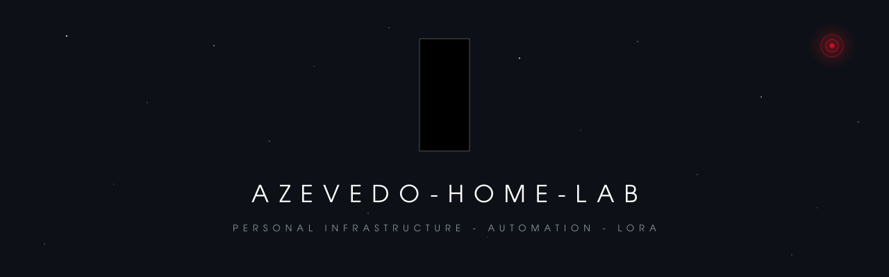
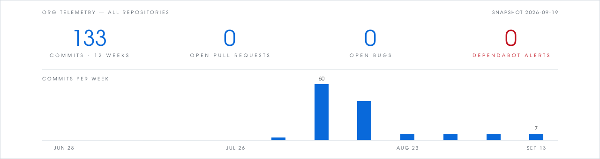

  <picture>
    <source media="(prefers-color-scheme: light)" srcset="assets/banner-light.svg">
    
  </picture>

  

T E L E M E T R Y

  

  

M A N I F E S T

| REPOSITORY | LANGUAGE | FUNCTION |
|:---|:---|:---|
| [save-note-api](https://github.com/azevedo-home-lab/save-note-api) | PYTHON | KNOWLEDGE-BASE API — NOTES, TRANSCRIPTION, INSIGHTS |
| [homelab](https://github.com/azevedo-home-lab/homelab) | SHELL | PROXMOX + K3S INFRASTRUCTURE AS CODE |
| [loralab-infra](https://github.com/azevedo-home-lab/loralab-infra) | SHELL | LORAWAN NETWORK — CHIRPSTACK, GATEWAY, VPN |
| [Lab-Infrastructure](https://github.com/azevedo-home-lab/Lab-Infrastructure) | ROUTEROS SCRIPT | MIKROTIK ROUTER CONFIGURATION |
| [claude-code-workflows](https://github.com/azevedo-home-lab/claude-code-workflows) | SHELL | AI DEVELOPMENT WORKFLOWS AND JUDGES |
| [codex-workflows](https://github.com/azevedo-home-lab/codex-workflows) | — | CODEX AGENT WORKFLOWS |
| [privacy-web-search-mcp](https://github.com/azevedo-home-lab/privacy-web-search-mcp) | JAVASCRIPT | PRIVACY-FOCUSED WEB SEARCH MCP SERVER |
| [TokenEater](https://github.com/azevedo-home-lab/TokenEater) | SWIFT | MACOS WIDGET — AI USAGE MONITORING |

  

O P E R A T I O N S

| STATION | FUNCTION |
|:---|:---|
| [SAVENOTES BACKLOG](https://github.com/orgs/azevedo-home-lab/projects/1) | PRODUCT BOARD — SAVE-NOTE-API |
| [HOMELAB OPS](https://github.com/orgs/azevedo-home-lab/projects/3) | INFRASTRUCTURE BOARD |
| [CLAUDE CODE WORKFLOWS](https://github.com/orgs/azevedo-home-lab/projects/4) | WORKFLOW MANAGER BOARD |
| [BETTERSTACK](https://uptime.betterstack.com) | UPTIME AND INCIDENT MONITORING |
| [BITWARDEN](https://vault.bitwarden.eu) | SECRETS VAULT — EU |
| [TAILSCALE](https://login.tailscale.com/admin/machines) | PRIVATE MESH NETWORK |

  

L A B&nbsp;&nbsp;&nbsp;P R I N C I P L E S

  Build it yourself. Know every layer. 
  Automate what repeats. Record what matters. 
  Small machines, precisely instructed.

  

PERSONAL LABORATORY — NOT A PRODUCT

